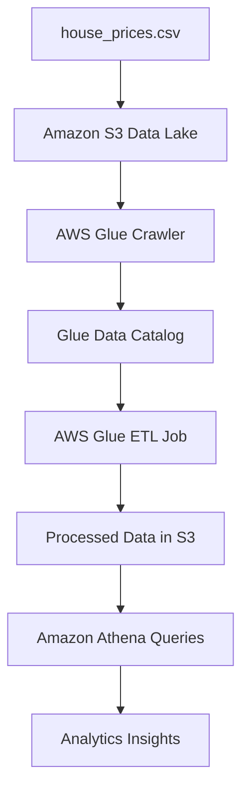
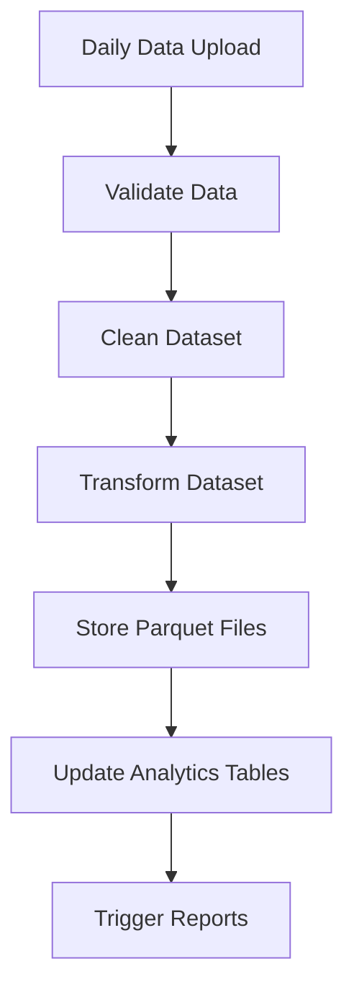
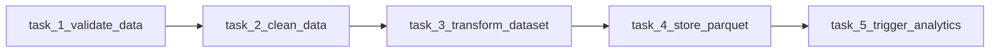
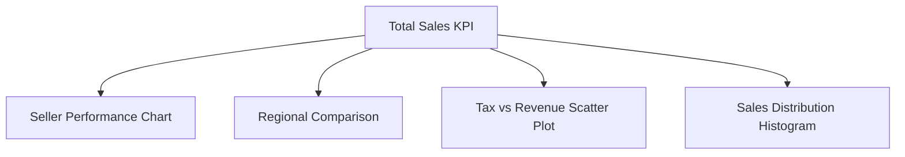

# AWS Data-SPARK Internship Repository  
## London Success Academy Joint Internship Programme

Welcome to the **AWS Data-SPARK Internship Repository**.

This repository supports the **London Success Academy Joint Internship Programme**, introducing students to **real-world data engineering workflows using cloud technologies**.

The internship follows the **Data-SPARK Mentorship Framework**, created by **Venkat Potamsetti**, focusing on:

- Structured thinking  
- Data pipeline design  
- Cloud data engineering  
- Documentation discipline  
- Translating business problems into data workflows  

---

# Program Overview

The internship runs across **three progressive weeks**, each building new data engineering skills.

| Week | Topic | Focus |
|-----|------|------|
| Week 1 | Data Foundations & Cloud ETL | AWS Glue, Data Catalog, Athena |
| Week 2 | Data Pipeline Orchestration | DAG thinking and workflow automation |
| Week 3 | Analytics Dashboard | Business insights and visualisation |

---

# Learning Journey


This represents the **typical lifecycle of a data engineering workflow**.

---

# Week 1 – Data Foundations & Cloud ETL

## Business Scenario

Company: **UrbanNest Property Analytics Ltd**

UrbanNest is a London-based startup helping real estate agencies understand **housing market trends and property values**.

The company recently received housing data and needs a **cloud-based pipeline** so analysts can run queries.

Your task is to build the **initial AWS data pipeline**.

---

## Week 1 Architecture



---

## Week 1 Tasks

Students will:

1. Upload dataset to **Amazon S3**
2. Create **AWS Glue Crawler**
3. Build **Glue ETL Job**
4. Query dataset using **Amazon Athena**

---

## Dataset

`house_prices.csv`

| Column | Description |
|------|-------------|
| Rooms | Average number of rooms per property |
| Distance | Distance from employment hubs |
| Value | Median property value |

---

# Week 2 – Data Pipeline Orchestration

## Business Scenario

Company: **MarketFlow Property Intelligence**

UrbanNest has merged with MarketFlow and now receives **daily property datasets**.

Manual pipelines are inefficient.  
The company needs **automated data workflows**.

---

## Pipeline Workflow



---

## Example DAG Structure



---

## Week 2 Tasks

Students should design and document a **Directed Acyclic Graph (DAG)** pipeline including:

- Data validation
- Data transformation
- Data storage
- Triggering analytics jobs

Validation checks should include:

- Null values
- Duplicate records
- Data format validation

Students should also design a **monitoring strategy** for:

- Pipeline failures
- Missing datasets
- Job execution errors

---

# Week 3 – Analytics Dashboard Project

## Business Scenario

Company: **NovaCart E-Commerce**

NovaCart collects large amounts of **seller performance data** and needs a dashboard to understand business performance.

Your team must build a **simple analytics dashboard** for the leadership team.

---

## Analytics Workflow


---

## Dataset

`ecommerce.csv`

| Column | Description |
|------|-------------|
| Sale | Sales per capita |
| por_OS | Proportion of other sellers |
| avg_no_it | Average items per sale |
| TAX | Tax per 10,000 |
| Median_s | Median value of seller business |

---

## Dashboard Requirements

Intern dashboards should include:

- Sales Overview
- Seller Performance
- Regional Comparison
- Tax Impact Analysis

---

## Example Dashboard Structure



---

# Repository Structure

```
AWS-Dataspark
│
├── datasets
│   ├── house_prices.csv
│   └── ecommerce.csv
│
├── week1
│   └── AWS_ETL_Workflow
│
├── week2
│   └── Pipeline_Orchestration
│
├── week3
│   └── Dashboard_Project
│
├── documentation
│   ├── Week1_Data_Foundations.docx
│   ├── Week2_Pipeline_Orchestration.docx
│   └── Week3_Dashboard_Project.docx
│
└── README.md
```

---

# Expected Deliverables

### Week 1

- AWS Glue crawler setup
- Athena SQL queries
- ETL pipeline documentation

### Week 2

- DAG workflow diagram
- Pipeline documentation
- Monitoring strategy

### Week 3

- Dashboard screenshots
- Presentation slides
- Insights report

---

# Skills Developed

### Technical Skills

- Cloud data engineering  
- ETL pipeline design  
- Workflow orchestration  
- SQL analytics  
- Dashboard development  

### Professional Skills

- Structured problem solving  
- Technical documentation  
- Analytical thinking  
- Data storytelling  

---

# Mentor

**Venkat Potamsetti**  
Data Engineering Mentor  
Creator of the **Data-SPARK Mentoring Framework**

---

# License

This repository is intended for **educational use within the London Success Academy Internship Programme**.
