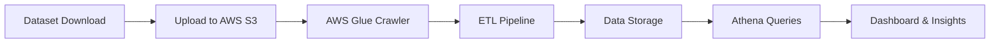

# Datasets – AWS Data-SPARK Internship

This folder contains datasets used in the **London Success Academy Joint Internship Programme** as part of the **Data-SPARK Data Engineering Mentorship** led by **Venkat Potamsetti**.

These datasets support the practical exercises across the three-week internship programme where students learn to design **cloud data pipelines, orchestrate workflows, and build analytics dashboards**.

---

# Dataset 1 – Housing Market Data

File:

```
house_prices.csv
```

This dataset is used in **Week 1 – Data Foundations & Cloud ETL**.

Students use this dataset to build a **cloud data pipeline using AWS services** including:

- Amazon S3
- AWS Glue
- AWS Glue Data Catalog
- AWS Glue ETL Jobs
- Amazon Athena

The goal is to simulate a real-world scenario where a property analytics company needs to store, catalogue, and analyse housing market data.

---

## Variables

| Column | Description |
|------|-------------|
| Rooms | Average number of rooms per property |
| Distance | Weighted distance from employment hubs |
| Value | Median property value (in thousands) |

---

## Learning Objectives

Using this dataset students will learn how to:

- Upload data into a **cloud data lake**
- Detect schema automatically using **AWS Glue Crawlers**
- Run simple **ETL pipelines**
- Query data using **SQL in Amazon Athena**
- Understand **data pipeline architecture**

---

# Dataset 2 – E-Commerce Seller Analytics

File:

```
ecommerce.csv
```

This dataset is used in **Week 3 – Analytics Dashboard Project**.

Students analyse e-commerce data and build a **business dashboard** that explains seller performance and market trends.

The goal is to simulate a real business analytics scenario where leadership teams require **clear insights from transaction data**.

---

## Variables

| Column | Description |
|------|-------------|
| Sale | Sales per capita |
| por_OS | Proportion of other sellers |
| por_NON | Proportion of non-retail sellers |
| recc | Recommended seller (1 = Yes, 0 = No) |
| avg_no_it | Average number of items per sale |
| age | Proportion of units sold by seller |
| dis | Distance to sellers |
| diff_reg | Accessibility index to different regions |
| TAX | Tax per 10,000 |
| B | Retail proportion index |
| lowstat | Percentage of lower status sellers |
| Median_s | Median value of seller business (in $1000s) |

---

## Learning Objectives

Using this dataset students will learn to:

- Perform **exploratory data analysis**
- Understand relationships between **sales, tax, and regional access**
- Build **business dashboards**
- Present **data-driven insights**

---

# Internship Workflow

The datasets support the following data engineering learning workflow.



---

# Folder Structure

```
datasets
│
├── house_prices.csv
├── ecommerce.csv
│
└── metadata
    ├── house_prices_metadata.txt
    └── ecommerce_metadata.txt
```

---

# Usage Guidelines

- These datasets are intended for **educational use within the internship programme**.
- Students should **not modify the original datasets directly**.
- Any transformed datasets should be stored in a **separate processed data folder or cloud storage location**.

---

# Mentor

**Venkat Potamsetti**  
Data Engineering Mentor  
Creator of the **Data-SPARK Mentorship Framework**

